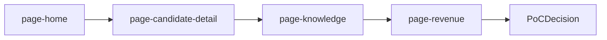

# 経営層向けデモスライド構成（5〜10分）

## 0. この資料の使い方
- 対象: 経営層（投資対効果・差別化・導入リスクを重視）
- 目的: 「外部SaaS依存のままか / 自社データ資産を育てるか」の意思決定を前進させる
- 前提: 既存仕様は `docs/pages/page-*.md`、再設計差分は `docs/pages/redesign/*.md` を参照

## 1. スライド全体設計（9枚）

### Slide 1. 現状の構造課題（現状否定）
- タイトル: 便利なSaaSは導入できるが、判断知は自社に残らない
- 1メッセージ: 管理は最適化されても、勝ち筋は資産化されない
- 話すポイント:
  - 既製品で標準業務は回るが、御社独自の査定基準は外部仕様に吸収される
  - 解約時に判断ログや学習文脈が切れると、再現性が崩れる
  - 差別化の源泉が「運用努力」止まりになる

### Slide 2. 提案の定義（結論先出し）
- タイトル: 今回作るのはATSの代替ではなくCompany Brain
- 1メッセージ: 管理システムではなく、判断速度と判断品質を同時に高める基盤
- 話すポイント:
  - 指標はUI機能数ではなく、判断時間・漏れ率・粗利インパクトで評価する
  - 「使うほど御社専用に賢くなる」を中心価値に置く

### Slide 3. デモ全体像（3機能）
- タイトル: 10分で示す価値は3つだけ
- 1メッセージ: AI査定 -> 優先行動 -> 学習蓄積を1本で見せる
- 話すポイント:
  - 攻め: AI爆速プロファイリング
  - 実務: 今日フォローすべき人
  - 資産: AIナレッジ・インキュベーター

### Slide 4. 攻めの機能（AI爆速プロファイリング）
- タイトル: 1枚5分の読解を10秒判断へ
- 使用画面: `page-candidate-detail.md`
- 1メッセージ: 査定スピードの改善ではなく、査定基準の資産化が本質
- 話すポイント:
  - PDF投入後、売り先候補・想定年収・マッチ度・根拠を即表示
  - 人間が読む前に「何を確認すべきか」をAIが絞る
  - 判断根拠ログが再利用され、次回精度が上がる

### Slide 5. 実務の機能（今日フォローすべき人）
- タイトル: 情報の倉庫ではなく、朝の司令塔にする
- 使用画面: `page-home.md`, `page-candidates.md`
- 1メッセージ: 迷いを減らして、行動順を自動化する
- 話すポイント:
  - 最終連絡日・停滞ステータスで優先順を自動提示
  - 「上から電話するだけ」で漏れ率を下げる
  - 管理ではなく実行に寄せたUXで現場再現性を作る

### Slide 6. 資産の機能（AIナレッジ・インキュベーター）
- タイトル: 解約で消えるデータか、会社に残る脳か
- 使用画面: `page-knowledge.md`
- 1メッセージ: 成功/失注の文脈を次回査定に反映し続ける仕組み
- 話すポイント:
  - 企業ごとの好み、失注要因、面接評価の癖を蓄積
  - 次回の提案時に、過去学習を前提に助言を返す
  - 人依存のノウハウをチーム資産に変換する

### Slide 7. ROI（経営指標への接続）
- タイトル: 効率化の話で終わらせず、粗利で語る
- 使用画面: `page-revenue.md`
- 1メッセージ: 時短ではなく、売上速度と利益確度を改善する投資
- 話すポイント:
  - `timeSavedMinutesPerDay`
  - `followLeakageRate`
  - `proposalCycleHours`
  - `knowledgeReuseRate`
  - `grossMarginImpactManYen`

### Slide 8. 開発戦略（不誠実な開発の拒絶）
- タイトル: 完コピはしない。土台を作って、現場で育てる
- 参照: `implementation-phased-roadmap.md`
- 1メッセージ: 大規模一括より、小さく立ち上げて高速学習する
- 話すポイント:
  - いきなり全機能移植は投資効率が悪い
  - まずAI土台を作り、現場データで精度を上げる
  - 半年で「使える武器」に仕上げるロードマップを提示

### Slide 9. 意思決定の一言（クロージング）
- タイトル: システムを買うか、会社の脳を育てるか
- 1メッセージ: PoC開始条件をここで合意し、前に進む
- 話すポイント:
  - PoC範囲（対象職種/企業群/担当チーム）
  - 初月KPI（3つに絞る）
  - 4週間後レビュー日をその場で確定

## 2. 5〜10分の話す順序メモ（各30〜45秒）
- Slide 1（40秒）: 現状の痛みを「資産が残らない」の一点に絞る
- Slide 2（30秒）: 提案定義を先出しし、比較軸を固定する
- Slide 3（30秒）: 3機能を1本の業務ループで示す
- Slide 4（60秒）: AI査定デモを最初に見せ、瞬間的インパクトを作る
- Slide 5（50秒）: 朝の行動自動化で現場価値を補強する
- Slide 6（55秒）: 学習蓄積で中長期優位を確定させる
- Slide 7（45秒）: KPIで経営判断に接続する
- Slide 8（50秒）: 完コピ否定と段階投資でリスクを下げる
- Slide 9（30秒）: PoC合意事項を明確化して締める

## 3. デモ導線（最小固定）
- 固定導線: `home` -> `candidate-detail` -> `knowledge` -> `revenue`
- デモ中の一言ルール:
  - `home`: 「今日、誰から動くかを迷わせない」
  - `candidate-detail`: 「判断の根拠を10秒で揃える」
  - `knowledge`: 「判断を次回に再利用する」
  - `revenue`: 「成果を粗利インパクトで確認する」

## 4. Before -> After 比較スライド用メッセージ（再設計差分反映）
- Before: 情報カードを読み回す運用  
  After: 主役パネルで次の1アクションを即決
- Before: AI分析は見えるが、実行に繋がりにくい  
  After: AI根拠と確定CTAを同一面で完結
- Before: 朝の優先順は担当者の勘に依存  
  After: 停滞日数と期限で電話順を自動化
- Before: 面接評価は記録で終わる  
  After: 品質修正が次回マッチング助言に反映
- Before: 書類・調整・連絡が分断  
  After: キュー中心設計で停止案件を復帰し続ける

## 5. デモ中に必ず言うキーフレーズ集

### 外部依存リスク
- 「運用は改善できても、判断知が外に貯まる構造は変わりません」
- 「解約時に失うのはデータ量ではなく、御社の判断文脈です」

### 資産化価値
- 「このAIの判断基準そのものが御社のナレッジ資産です」
- 「使うほど御社専用に賢くなる“会社の脳”を育てます」

### ROI
- 「時短のための投資ではなく、粗利を伸ばすための投資です」
- 「機能数ではなく、提案速度と再利用率で成果を測ります」

## 6. 面談後の次アクション定義テンプレ
- PoC対象:
  - 職種:
  - 企業セグメント:
  - 対象担当者数:
- 4週間KPI（3つ）:
  - `followLeakageRate`:
  - `proposalCycleHours`:
  - `knowledgeReuseRate`:
- 運用ルール:
  - 週次レビュー曜日:
  - 判断ログ記入責任者:
  - モデル改善フィードバック窓口:
- 合意事項:
  - 本番移行判断日:
  - 次回商談日:

## 7. 実施チェックリスト（発表前）
- スライド1枚1メッセージになっている
- 画面デモは固定導線から逸脱しない
- 価格論点はSlide 8でのみ触れ、先に価値を伝える
- クロージングで「次回日程」まで確定させる
